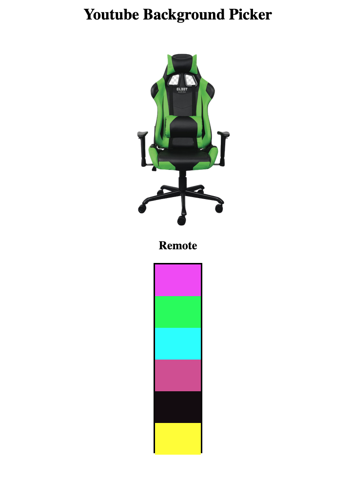

<h2>Background Picker Project</h2>

<h3>Built with:</h3>
<ul>
  <li>HTML </li> 
  <li>CSS (Flexbox)</li>
  <li>vanilla javascript</li> 
</ul>

<b>What I learned:</b>

<ul>
  <li>Event listeners</li>
  <li>Responsive Layouts</li>
  <li></li>

</ul>

<b>Continued development:</b>
I'd add in some photo background options.
